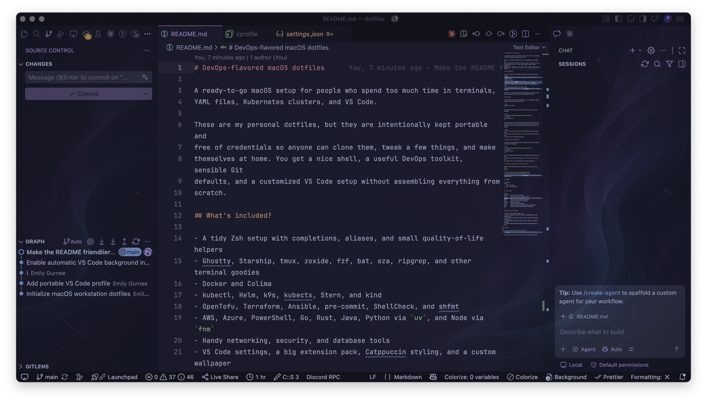
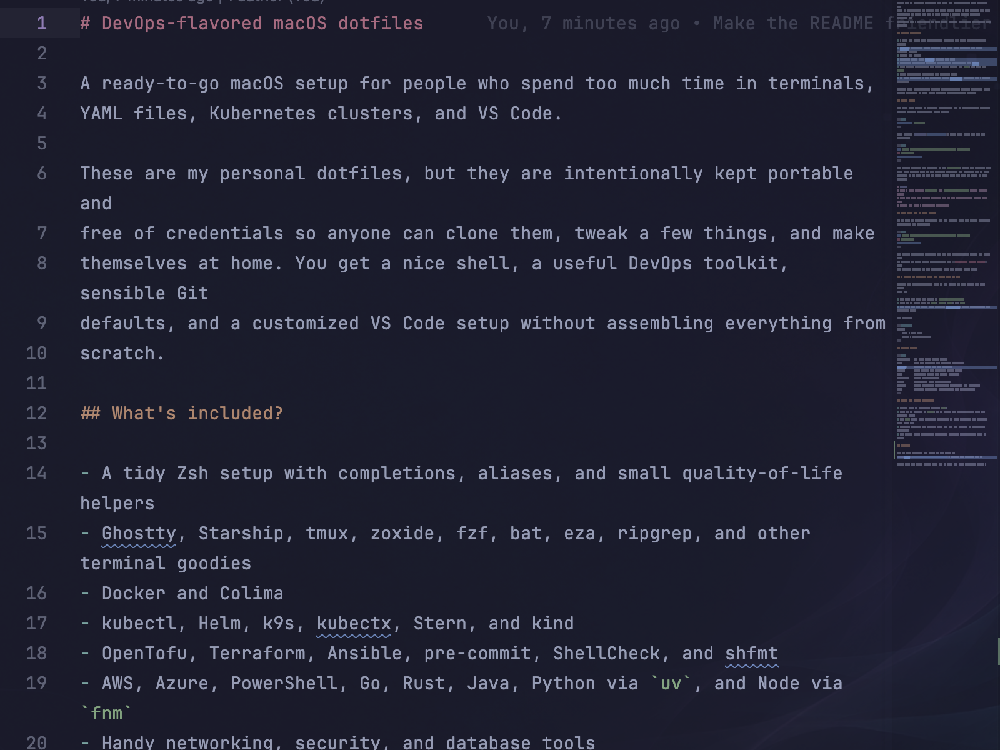

# DevOps-flavored macOS dotfiles

A ready-to-go macOS setup for people who spend too much time in terminals,
YAML files, Kubernetes clusters, and VS Code.

These are my personal dotfiles, but they are intentionally kept portable and
free of credentials so anyone can clone them, tweak a few things, and make
themselves at home. You get a nice shell, a useful DevOps toolkit, sensible Git
defaults, and a customized VS Code setup without assembling everything from
scratch.

## A quick peek





## What's included?

- A tidy Zsh setup with completions, aliases, and small quality-of-life helpers
- Ghostty, Starship, tmux, zoxide, fzf, bat, eza, ripgrep, and other terminal goodies
- Docker and Colima
- kubectl, Helm, k9s, kubectx, Stern, and kind
- OpenTofu, Terraform, Ansible, pre-commit, ShellCheck, and shfmt
- AWS, Azure, PowerShell, Go, Rust, Java, Python via `uv`, and Node via `fnm`
- Handy networking, security, and database tools
- VS Code settings, a big extension pack, Catppuccin styling, and a custom wallpaper

Nothing here automatically applies infrastructure, deletes clusters, force
pushes branches, or does other exciting career-limiting things.

## Quick start

You will need macOS, an internet connection, and an administrator account.
Install Apple's command-line tools first:

```bash
xcode-select --install
```

Then install [Homebrew](https://brew.sh), clone this repo, and run the bootstrap:

```bash
git clone https://github.com/ohemilyy/macOS.git ~/dotfiles
cd ~/dotfiles
./bootstrap/macos.sh
```

The script installs the packages in the `Brewfile`, links the dotfiles into
your home folder, sets up the language runtimes, and restores the VS Code
profile. It is fine to run it again later when you want to catch up with changes.

> [!TIP]
> Have a look through `Brewfile` and `bootstrap/macos.sh` before running them.
> Fork the repo and remove anything you do not want—dotfiles should feel like
> yours, not like a mysterious appliance.

## Just want the VS Code setup?

If VS Code is already installed, you can restore only the editor settings,
extensions, and wallpaper:

```bash
git clone https://github.com/ohemilyy/macOS.git ~/dotfiles
cd ~/dotfiles
./vscode/install.sh
```

The custom background extension may ask for administrator access the first time
it patches VS Code. After installation, run **Developer: Reload Window** from
the Command Palette if the wallpaper does not appear right away.

## A couple of personal bits you still need to add

Secrets and machine-specific data do not belong in this repo. You will still
need to:

- Put your Git name and email in `~/.gitconfig.local`
- Sign in to tools such as `gh`, `aws`, `az`, and `bw`
- Add your own SSH keys, host aliases, kubeconfigs, cloud credentials, and Tailscale login

For example:

```gitconfig
[user]
    name = Your Name
    email = you@example.com
```

## What's where?

```text
bootstrap/   the main macOS setup script
git/         safe Git defaults (no personal identity)
ghostty/     terminal theme and key bindings
shell/       small .zshrc and .zprofile entry points
ssh/         non-secret macOS SSH client defaults
starship/    prompt configuration
tmux/        lightweight tmux configuration
vscode/      editor settings, extensions, wallpaper, and installer
zsh/         aliases, functions, completions, and integrations
```

## Notes for fellow tinkerers

- Python 3.13 is installed through `uv`.
- Node 22 is managed by `fnm`; it is pinned for compatibility with the included CLIs.
- The `tf` alias uses OpenTofu. Terraform is also installed for projects that need it.
- Database packages are clients only and are not started as background services.
- The prompt makes production Kubernetes contexts intentionally hard to miss.

## Credits

The VS Code settings are based on the setup by
[AndyReckt](https://github.com/andyreckt). Thanks for sharing it! 💜

Steal what you like, delete what you do not, and make something cozy. ✨
